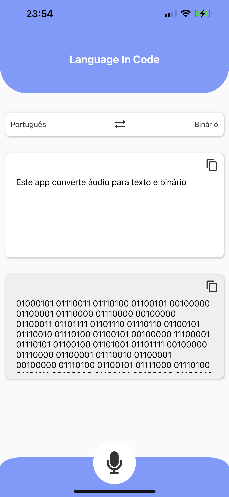

# Language in Code

<table>
  <tr>
    <td>
      
    </td>
  </tr>
</table>

## Descrição

O **Language in Code** é um aplicativo desenvolvido com o framework Expo, projetado para ajudar os usuários a capturar voz e converter o áudio em texto e em representação binária. Com esta aplicação, você pode facilmente transformar o que é dito em voz em texto e, em seguida, em binário.

## Funcionalidades

- Captura de Voz: Grave sua voz e converta em texto.
- Conversão em Texto: Converta a fala gravada em texto legível.
- Conversão em Binário: Transforme o texto em sua representação binária correspondente.
- Interface Amigável: Uma interface de usuário simples e intuitiva para facilitar o uso.

## Tecnologias Utilizadas

- [Expo](https://expo.dev/): Um conjunto de ferramentas e serviços para criar aplicativos nativos com React.
- [react-native-voice](https://www.npmjs.com/package/@react-native-voice): Uma biblioteca para reconhecimento de voz no React Native.
- [React Native Gesture Handler](https://docs.swmansion.com/react-native-gesture-handler/docs/): Biblioteca para lidar com gestos e toques no React Native.

## Instalação

Para experimentar o **Language in Code**, siga estas etapas:

1. Clone o repositório para o seu ambiente de desenvolvimento.
2. Navegue até a pasta do projeto e execute `npm install` para instalar as dependências.
3. Execute `expo start` para iniciar o aplicativo.

Certifique-se de ter o [Expo CLI](https://docs.expo.dev/get-started/installation/) instalado no seu ambiente de desenvolvimento.

## Contribuição

Contribuições são bem-vindas! Se você deseja melhorar ou expandir as funcionalidades do aplicativo, sinta-se à vontade para abrir um pull request ou relatar problemas na seção de [issues](link-para-o-repositorio/issues).

## Licença

Este projeto está licenciado sob a [Licença MIT](LICENSE).
